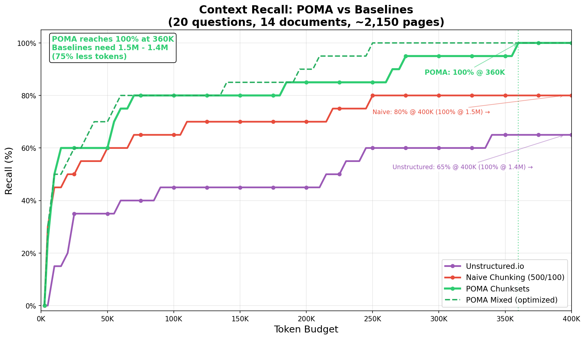
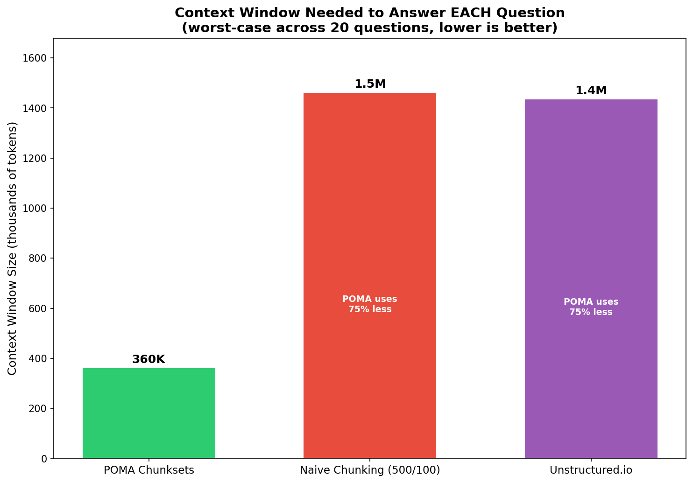
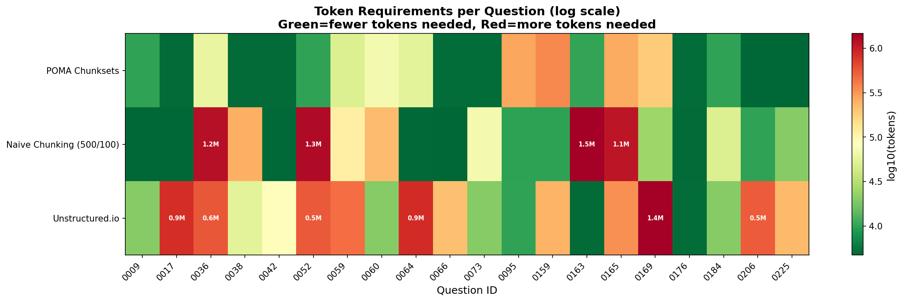
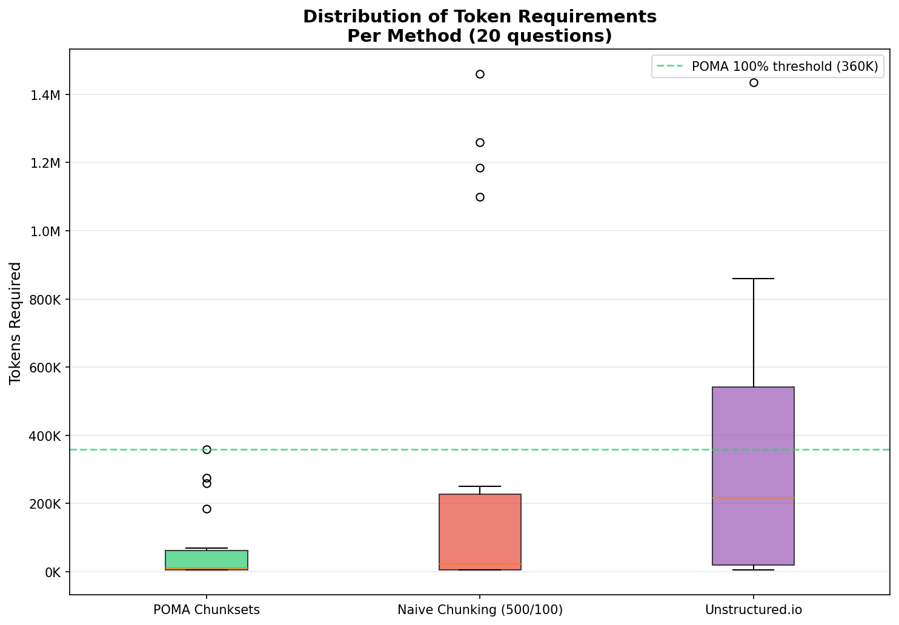
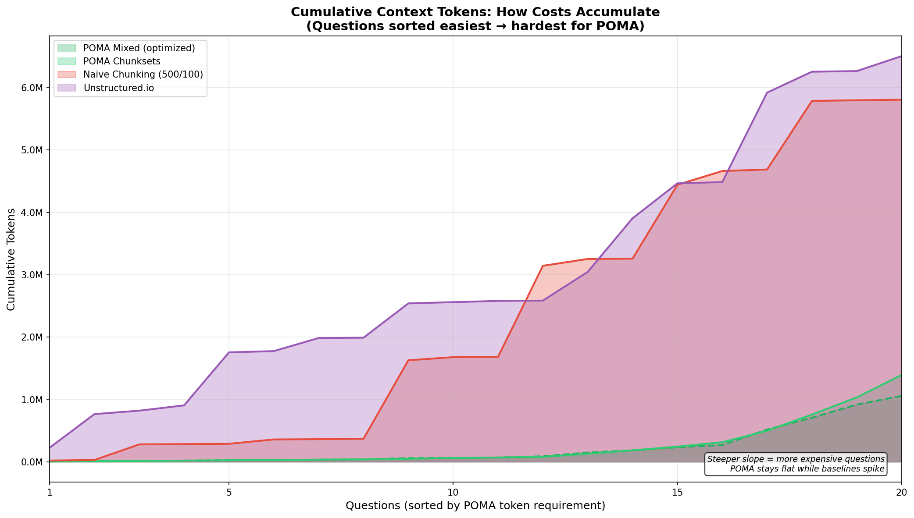
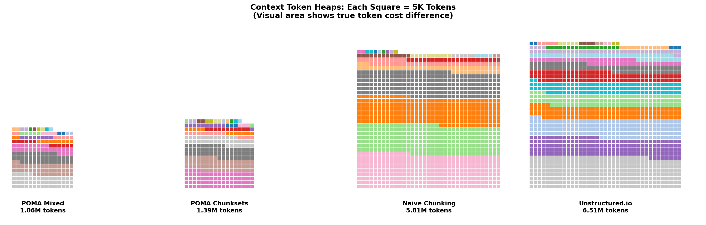

# Benchmarking POMA AI RAG Chunking against Conventional Chunking and Unstructured.io

[](https://www.python.org/downloads/)
[](LICENSE)
[](data/officeqa.csv)
[](https://www.poma-ai.com/docs/)

## Non-Tech TLDR;

**AI can't remember facts. And that's a problem for the multibillion-dollar industry built on top of it.**

Consider a simple query: *"What was the average US banknote in circulation worth in 2011?"* A large language model might confidently say $10 — or $20, or $50. The uncertainty isn't a bug; it's how these models work. The **correct** answer — $32.70 — sits in a denomination table buried inside a 150-page Treasury Bulletin.

For any task requiring factual accuracy, one must provide the facts at query time. This is the job of Retrieval-Augmented Generation (RAG).

But standard RAG pipelines have a critical flaw. Their ingestion chops documents into flat, fixed-length "chunks" and hopes for the best. This brute-force approach creates a cascade of problems:

- **Orphaned headings** arrive in prompts without their corresponding text
- **Split tables** lose their integrity when cut in half
- **Broken context** occurs when values get separated from their defining row and column headers
- **Hallucinatory gaps** emerge when models receive partial context and fill voids with statistically likely — but factually incorrect — information

POMA's answer is deceptively simple: respect a document's native structure instead of imposing arbitrary boundaries. Like a librarian who understands that a table's meaning lives in its headers, POMA preserves the document's hierarchy before breaking it apart.

To prove its importance, we took [OfficeQA](https://github.com/databricks/officeqa) — Databricks' benchmark of table-lookup questions against U.S. Treasury Bulletins — and asked a different question: not *"can the model answer correctly?"* but *“how much of the evidence does the retriever find for a given token budget?”*

We selected 20 questions across 14 Treasury Bulletins (~2,150 pages), ran three chunking pipelines through identical embeddings, and measured one thing: **context recall** — the minimum tokens of retrieved context required to recover all evidence for a correct answer.

The result? **POMA uses 75% fewer tokens to achieve 100% context recall.**

---

## Key Result



| Method | 100% Recall At | vs POMA |
|--------|---------------:|---------|
| Naive Chunking (500/100) | 1.46M tokens | POMA uses 75% less |
| Unstructured.io | 1.44M tokens | POMA uses 75% less |
| **POMA Chunksets** | **360K tokens** | **baseline** |

"Worst-case budget" = the context window needed to cover evidence for the hardest question. At a ~360K maximum context limit, POMA can cover evidence for every question; baselines need ~1.44–1.46M.



---

## The Problem: Complex Information doesn't Survive Naive Chunking

Treasury Bulletins are structured objects: multi-column tables with spanning headers, footnotes defining abbreviations, section titles that disambiguate which statistic you're reading.

When you run `RecursiveCharacterTextSplitter(chunk_size=500, chunk_overlap=100)`, you're hoping the retriever finds your needle. But what if the chunk containing "5.47%" got separated from the row header saying "1996"?

This is **context fragmentation**: not failure to retrieve *something*, but failure to retrieve the *meaning* with the number.

---

## Results in Detail

### Per-Question Token Requirements

Not all questions are equally hard. This heatmap shows the context window needed for each question (log scale):



Green = small context needed. Red = large context needed.

POMA (top row) is consistently greener and shows much fewer outliers.
The two baselines show that very coarse (naive) chunking and very fine-grained one either face the same challenges, or show clear trade-offs when one excels exactly where the other one fails.

### Distribution of Token Requirements



POMA's worst case (360K, dashed line) is better than the baselines' *median*.

### Total Context Cost

Sum of per-question minimum budgets (how much context you "buy" in aggregate). This table includes POMA Mixed, which re-ranks chunksets using a weighted blend of chunkset and chunk similarity (see [Methods Compared](#methods-compared) for details):

| Method | Total Tokens (all 20 questions) |
|--------|--------------------------------:|
| Unstructured.io | 6.51M |
| Naive Chunking | 5.81M |
| **POMA Chunksets** | **1.39M** |
| **POMA Mixed** | **1.06M** |

### Cumulative Context Growth



### Token Heaps (area proportional to tokens)



---

## Dataset

- **Documents:** 14 U.S. Treasury Bulletins (1939-2020), ~2,150 pages
- **Questions:** 20 table-lookup questions from [OfficeQA](https://github.com/databricks/officeqa)
- **Source:** [FRASER Digital Library](https://fraser.stlouisfed.org/title/treasury-bulletin-407)

### Methods Compared

The benchmark compares three chunking strategies head-to-head, plus an optimized POMA variant:

| Method | Approach | Retrieval Units |
|--------|----------|----------------:|
| Naive Chunking | Token-based `RecursiveCharacterTextSplitter(500, 100)` | ~9K chunks |
| Unstructured.io | Element-based extraction (by_title strategy) | ~27K elements |
| **POMA Chunksets** | Hierarchical chunks grouped into semantic bundles | ~23K chunksets |
| **POMA Mixed** | Chunksets re-ranked by a weighted blend of chunkset + chunk similarity | same |

- **POMA Chunksets** is the apples-to-apples baseline — same retrieval logic as the others, no tuning.
- **POMA Mixed** exploits POMA's dual output (chunks *and* chunksets) to re-rank results. It uses a tunable weight (`w=0.65` here) and is dataset-specific, so the headline comparison uses Chunksets.

All methods use **identical embeddings** (`text-embedding-3-large`) and **identical evaluation logic**. The only variable is how documents are represented/chunked.

---

## Baseline Chunking Parameters

We do **not** claim that 500/100 are LangChain defaults; they are a common **token-based** baseline choice used in many RAG implementations.

- **Naive baseline:** 500-token chunks with 100-token overlap (20%), token-counted with `cl100k_base`

For reference, managed retrievers use larger chunks and/or higher overlap:
- OpenAI File Search: 800-token chunks, 400-token overlap ([docs](https://platform.openai.com/docs/assistants/tools/file-search))
- Google Vertex AI RAG Engine: 1024-token chunks, 256-token overlap ([docs](https://cloud.google.com/vertex-ai/generative-ai/docs/rag-engine/rag-transformations))

---

## Methodology

### Token Counting

- **Tokenizer:** `tiktoken` with `cl100k_base`
- **Counted text:** Raw chunk text only (no metadata, no prompt templates)
- **Deduplication:** Identical text blocks counted once

### Evaluation Algorithm

1. Embed the question using `text-embedding-3-large`
2. Rank ALL chunks by cosine similarity (no early stopping)
3. Accumulate chunks in rank order, deduplicating identical content
4. Binary search to find minimum budget where all gold indices are present (5K precision)

### Why Index-Based Evaluation?

We use **exact chunk indices** as ground truth, not text patterns:

```json
{
  "UID0184": {
    "found_in": {"treasury_bulletin_1948_03": [524]},
    "needle_values": ["1.25"]
  }
}
```

This eliminates false positives (e.g., "5.47%" appearing in the wrong year's row). Gold sets live in `data/evidence_requirements.json`.

### Fairness Guarantees

- **Same embedding model** for all methods
- **Same retrieval logic** (cosine similarity ranking)
- **Pre-registered inclusion rule:** Questions excluded if _any of the methods_ can't find the evidence

We excluded questions where baselines had extraction failures (OCR errors, missing values). The 20 included questions are answerable by all methods.

---

## Quick Start

```bash
git clone https://github.com/poma-ai/poma-officeqa.git
cd poma-officeqa
pip install -r requirements.txt
python benchmark.py
```

Embeddings are pre-computed in `vectors/`. Set `OPENAI_API_KEY` only if you want to recompute.

### Run Specific Methods

```bash
python benchmark.py --method poma_openai_chunksets
python benchmark.py --method poma_openai_mixed
python benchmark.py --method databricks_rcs_openai
python benchmark.py --method unstructured_openai
```

### Regenerate Visualizations

```bash
python visualize_results.py --input results/bench_results/bench_idx_20260204_142157.json
```

---

## Going Further: POMA Mixed

POMA produces both chunks *and* chunksets. **Mixed** re-ranks chunksets by blending both similarity signals:

```
score = w * chunkset_sim + (1-w) * max(chunk_sims_in_chunkset)
```

With `w=0.65`, POMA Mixed achieves 100% recall at **250K tokens** — an 83% reduction over baselines and 30% over Chunksets alone:

```bash
python benchmark.py --method poma_openai_mixed --weight 0.65 --agg max
```

The weight is tunable per use case; `0.65` was optimized for this dataset. For a parameter-free comparison, use POMA Chunksets.

---

## Repository Structure

```
poma-officeqa/
├── benchmark.py              # Main benchmark runner
├── embed_all.py              # Embedding script
├── visualize_results.py      # Generate charts
├── bench/                    # Core benchmark modules
├── data/
│   ├── poma/                 # 14 .poma files (POMA output)
│   ├── databricks/           # 14 .txt files (naive chunking input)
│   ├── unstructured/         # 14 .json files (Unstructured.io output)
│   ├── officeqa.csv          # 20 questions
│   └── evidence_requirements.json  # Ground truth indices
├── vectors/                  # Pre-computed embeddings (~1 GB)
└── results/
    ├── bench_results/        # JSON outputs
    └── visualizations/       # Charts (used in this README)
```

---

## Try POMA

- **Product:** https://www.poma-ai.com
- **Docs:** https://www.poma-ai.com/docs/
- **API:** https://api.poma-ai.com/api/v1/docs
- **Pricing:** https://www.poma-ai.com/pricing

### Background Reading

- [Chunksets & Cheatsheets: How POMA Solves AI's Chunking Puzzle](https://medium.com/@POMA_AI/chunksets-cheatsheets-how-poma-solves-ais-chunking-puzzle-447bb8bc19c3)
- [RAG Chunking Strategies & Text Splitters](https://www.poma-ai.com/docs/rag-chunking-strategies-text-splitters)
- [Document Ingestion & Chunking for RAG](https://www.poma-ai.com/docs/document-ingestion-chunking-rag)

### Follow

- X: [_POMA_AI_](https://x.com/_POMA_AI_)
- LinkedIn: [POMA Science](https://www.linkedin.com/company/poma-science/)
- GitHub: [poma-ai](https://github.com/poma-ai)

---

## Citation

```bibtex
@software{poma_officeqa_2026,
  title   = {POMA-OfficeQA: Benchmarking POMA AI RAG Chunking against Conventional Chunking and Unstructured.io},
  author  = {POMA AI GmbH, Berlin},
  year    = {2026},
  url     = {https://github.com/poma-ai/poma-officeqa},
  note    = {Benchmark showing 75\%+ token reduction with semantic hierarchical chunking}
}
```

---

## License

MIT License — see [LICENSE](LICENSE)
